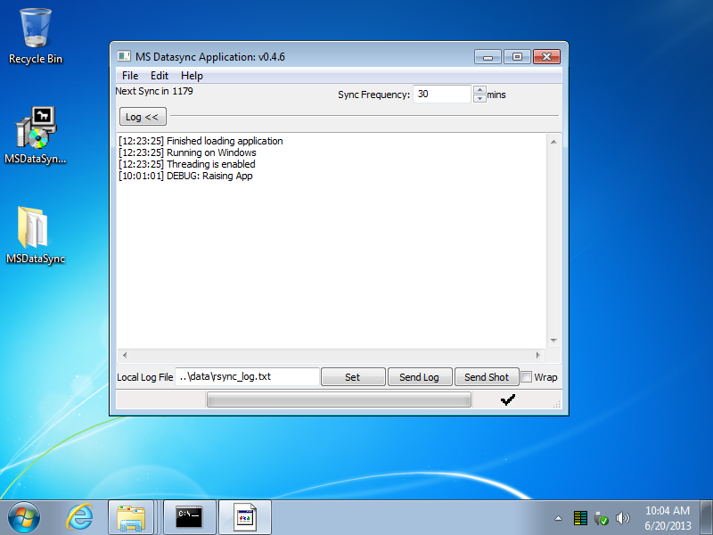
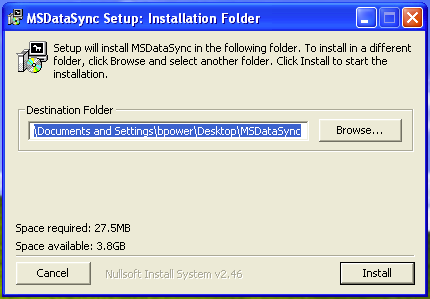
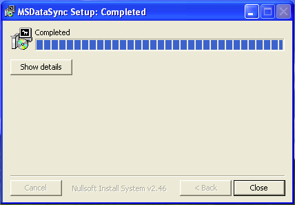
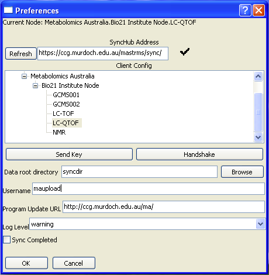
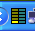

Data Sync Client
================

The Mastr-MS data sync client should be installed on the Windows
machine which is connected to the lab instrument.

It runs in the background and uploads experiment data as it is
produced by the lab instrument software.

The data sync client includes the well-known `rsync`_ tool and uses it
to transfer data.

.. _rsync: http://rsync.samba.org/

Installation
------------

The Mastr-MS client is packaged as a Windows installer .EXE file. The
latest version should be downloaded from:

    http://repo.ccgapps.com.au/ma/

By default the client will be installed to the MSDataSync folder on
the desktop.

During installation, a SSH key will be created in
``C:\Users\USER\Desktop\MSDataSync\id_rsa.pub`` (depends on chosen
install folder). This will be used for authentication to the MastrMS
repository.

Starting
--------

To start the data sync client application, open the installation
folder and double click "main.exe".

Configuration
-------------

Once installed, some configuration is required before the program can
be used to sync data. To configure the data sync client, visit the
*Edit -> Preferences* menu.

1. Click the *Refresh* button and then select the appropriate
   site. The lab machine needs to be able to access the SyncHub
   address over the network. If your machine is not on the list it
   will need to be set up on the server first (see
   :ref:`nodeclient-setup`).

2. Use the *Browse* button to select the folder containing your data.
 
3. Click *Send*Key" to upload the generated SSH key. The Mastr-MS
   server administrator will be e-mailed the key and must then install
   it (see :ref:`adding-keys`). Syncing will not be possible until the
   key is installed on the server. If the key was successfully sent,
   the main window will show "Key send response: ok" in the log.

4. After the administrator has added the key, click the "Handshake"
   button to test the connection. A black command console box will
   appear and ask you to type 'yes' or 'no' to confirm that you want
   to connect to the server. Type yes to proceed. This is a one time
   operation.

5. Click the OK button to save your changes.

6. The only other important configuration on the main screen is the
   "Sync Frequency", which is by default 30 minutes.

Usage
-----

You can force the sync client to check right now by clicking *File ->
Check Now*. Otherwise, the program will periodically sync according to
the configured interval.

If you close the client by clicking the [X] in the top corner of the
window, or minimise it with *File -> Minimize*, it will still be
running in the background. You can tell if the client is running if
you see this symbol in the system tray:

To re-open the client window, double click the icon, or right click
and select *Open Main Window*.

To fully quit the program you must choose *File -> Quit*.

Program Updates
---------------

Clicking *File -> Program Updates* will check the server to see if any
new updates are available. If a new version is available it will be
downloaded and applied, and the application must be restarted for the
updates to take effect.

Troubleshooting
---------------

If there are problems syncing, these will often appear as errors in
the log. The log can sometimes reveal the source of the error. It is
shown in the main window of the data sync application.

For troubleshooting purposes, the log and/or a screen capture of the
client application can be sent to the server administrator using the
*Send Log* and *Send Shot* buttons.
